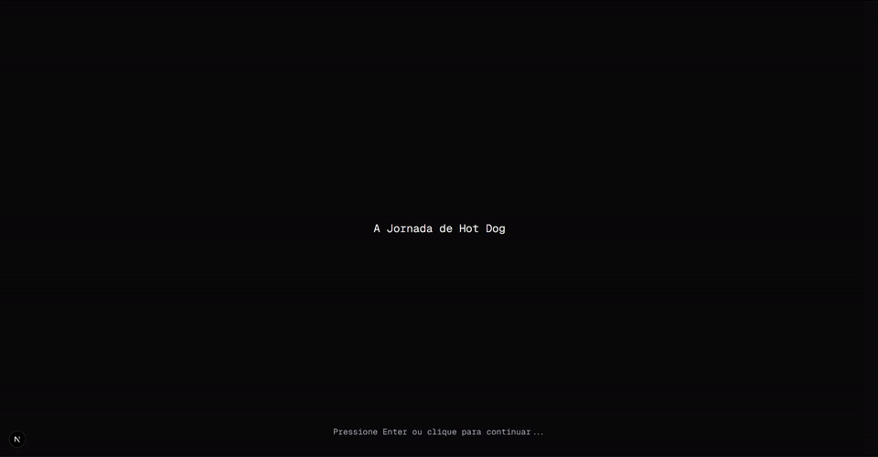

# ⚔️ Technical Challenge `Acelera ZG 9.0`

🇧🇷 Leia isto em [Português](README.md)

Project developed as part of the selection process for `Acelera ZG 9.0`.

## 📝 About the Project

An application that tells an interactive story (almost a simple RPG game) where the user progresses through the narrative by making choices and interacting via commands. The story allows navigating through events, locations, and challenges. The character evolves and acquires items along the journey.

## 🖼️ Screen (Preview)



## Deploy

[](https://desafio-zg9.vercel.app/)

## Challenge Objective

The objective is to evaluate programming logic, reading comprehension, and requirements analysis.

## Languages and Tools Used

[![Git][Git-logo]][Git-url]
[![ESLint][ESLint-logo]][ESLint-url]
[![TypeScript][TypeScript-logo]][TypeScript-url]
[![Tailwind CSS][Tailwind-CSS-logo]][Tailwind-CSS-url]
[![React][React-logo]][React-url]
[![Next.js][Next.js-logo]][Next.js-url]
[![Zustand][Zustand-logo]][Zustand-url]

## 🚀 Getting Started

1. **Prerequisites:**
    - [Node.js](https://nodejs.org/en) is required.

2. **Navigate to the frontend directory:**

    ```bash
    cd frontend
    ```

3. **Install dependencies:**

    ```bash
    npm install
    ```

4. **Run the development server:**

    ```bash
    npm run dev
    ```

5. **Open the URL in your browser:**

    ```bash
    http://localhost:3000
    ```

[React-logo]: https://img.shields.io/badge/react-%2320232a.svg?style=for-the-badge&logo=react&logoColor=%2361DAFB
[React-url]: https://reactjs.org
[TypeScript-logo]: https://img.shields.io/badge/typescript-%23007ACC.svg?style=for-the-badge&logo=typescript&logoColor=white
[TypeScript-url]: https://www.typescriptlang.org/
[Tailwind-CSS-logo]: https://img.shields.io/badge/tailwindcss-%2338B2AC.svg?style=for-the-badge&logo=tailwind-css&logoColor=white
[Tailwind-CSS-url]: https://tailwindcss.com/
[Git-logo]: https://img.shields.io/badge/git-%23F05033.svg?style=for-the-badge&logo=git&logoColor=white
[Git-url]: https://git-scm.com
[ESLint-logo]: https://img.shields.io/badge/ESLint-4B3263?style=for-the-badge&logo=eslint&logoColor=white
[ESLint-url]: https://eslint.org/
[Next.js-logo]: https://img.shields.io/badge/Next-black?style=for-the-badge&logo=next.js&logoColor=white
[Next.js-url]: https://nextjs.org/
[Zustand-logo]: https://img.shields.io/badge/Zustand-black?style=for-the-badge
[Zustand-url]: https://zustand-demo.pmnd.rs/
