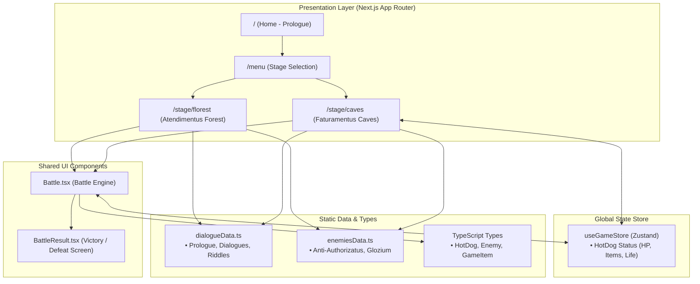

# ⚔️ Technical Challenge `Acelera ZG 9.0`

[](https://www.typescriptlang.org/)
[](https://nextjs.org/)
[](https://react.dev/)
[](https://tailwindcss.com/)
[](https://zustand-demo.pmnd.rs/)
[](https://desafio-zg9.vercel.app/)

> 🇧🇷 [**Português**](README.md) | 🇺🇸 **English Version**

An interactive narrative and choice-driven RPG adventure inspired by the healthcare billing and claims ecosystem, developed as a technical challenge solution for the **Acelera ZG 9.0** selection process.

## 📌 Quick Navigation

- [📝 About the Project](#-about-the-project)
- [🖼️ Preview](#️-preview)
- [🌐 Application Deployment](#-application-deployment)
- [✨ Features](#-features)
- [🛠️ Technologies and Tools Used](#️-technologies-and-tools-used)
- [🏛️ Solution Architecture](#️-solution-architecture)
- [📁 Repository Structure](#-repository-structure)
- [💡 Technical Decisions](#-technical-decisions)
- [🚀 How to Run the Project](#-how-to-run-the-project)

## 📝 About the Project

This project is an interactive web-based RPG where the player controls the hero **Hot Dog** on a quest to save the province of **Hospitalis** from the recurring threat of **Glozium**.

The game's lore makes allegorical references to the healthcare billing workflow (authorizations, invoicing, auditing, and claim denials/glosas). The player progresses across thematic stages, engaging in turn-based probabilistic battles based on secret numbers and special items, as well as solving conceptual riddles that directly impact battle conditions.

## 🖼️ Preview

<div align="center">
  
</div>

## 🌐 Application Deployment

Access the live application in production:
👉 **[Acelera ZG 9.0 Challenge](https://desafio-zg9.vercel.app/)**

## ✨ Features

- 📖 **Immersive Prologue & Storytelling**: Interactive dialogue progression supporting both keyboard (`Enter`) and mouse clicks.
- 🗺️ **Stage Selection (Adventure Map)**: Dynamic stage browser highlighting active and locked locations.
- ⚔️ **Turn-Based Battle Engine**:
  - Random draw mechanics evaluated against the opponent's secret number.
  - Dynamic damage calculation scaling with secret number values and hit counts.
  - Real-time auto-scrolling combat action log.
- 🎒 **Inventory Management & Special Artifacts**:
  - **Simple Sword**: Enables the core basic attack.
  - **Salsichinha**: Grants a combined attack with bonus damage (+1).
  - **Healthcare Guide (Guia de Atendimento)**: Grants double draws per round.
- 🧩 **Riddles with Real Consequences**: Lore-based questions where wrong choices inflict immediate damage or grant enemy buffs.
- 🧠 **Global State Persistence**: Hero attributes, current/max health, and unlocked inventory persist seamlessly across stages using Zustand.

## 🛠️ Technologies and Tools Used

| Layer / Purpose | Technology | Description |
| :--- | :--- | :--- |
| **Web Framework** | **Next.js 16 (App Router)** | High-performance rendering leveraging React Server and Client Components |
| **UI Library** | **React 19** | Foundation library for declarative component design and custom hooks |
| **Core Language** | **TypeScript 5.x** | Static typing ensuring consistent data contracts, models, and states |
| **Styling** | **Tailwind CSS 4.x** | Modern utility-first CSS framework for responsive and aesthetic UI |
| **State Management** | **Zustand 5.0.9** | Lightweight, decoupled global state management for hero data and inventory |
| **Code Quality** | **ESLint 9.x** | Static code analysis enforcing best practices and code hygiene |
| **Version Control** | **Git & GitHub** | Distributed version control and remote code hosting |
| **Deployment Platform** | **Vercel** | Seamless CI/CD cloud hosting with automatic edge deployment |

## 🏛️ Solution Architecture


```mermaid
graph TD
    subgraph "Presentation Layer (Next.js App Router)"
        Home["/ (Home - Prologue)"]
        Menu["/menu (Stage Selection)"]
        Florest["/stage/florest (Atendimentus Forest)"]
        Caves["/stage/caves (Faturamentus Caves)"]
    end

    subgraph "Shared UI Components"
        BattleComp["Battle.tsx (Battle Engine)"]
        BattleRes["BattleResult.tsx (Victory / Defeat Screen)"]
    end

    subgraph "Global State Store"
        ZustandStore["useGameStore (Zustand)<br/>• HotDog Status (HP, Items, Life)"]
    end

    subgraph "Static Data & Types"
        DataDialog["dialogueData.ts<br/>• Prologue, Dialogues, Riddles"]
        DataEnemies["enemiesData.ts<br/>• Anti-Authorizatus, Glozium"]
        Types["TypeScript Types<br/>• HotDog, Enemy, GameItem"]
    end

    Home --> Menu
    Menu --> Florest
    Menu --> Caves
    Florest --> BattleComp
    Caves --> BattleComp
    BattleComp --> BattleRes
    BattleComp <--> ZustandStore
    Caves <--> ZustandStore
    Florest --> DataDialog
    Caves --> DataDialog
    Florest --> DataEnemies
    Caves --> DataEnemies
    BattleComp --> Types
```

## 📁 Repository Structure

```text
desafio-zg9/
├── frontend/
│   ├── public/
│   │   ├── projeto.gif          # Animated demo of the application
│   │   ├── sal2.png             # Salsichinha item asset
│   │   ├── scroll.png           # Healthcare Guide item asset
│   │   └── sword.png            # Simple Sword item asset
│   ├── src/
│   │   ├── app/
│   │   │   ├── globals.css      # Global styling and Tailwind directives
│   │   │   ├── layout.tsx       # Root application layout
│   │   │   ├── menu/
│   │   │   │   └── page.tsx     # Stage selection menu
│   │   │   ├── stage/
│   │   │   │   ├── caves/
│   │   │   │   │   └── page.tsx # Faturamentus Caves stage + Riddle
│   │   │   │   └── florest/
│   │   │   │       └── page.tsx # Atendimentus Forest stage
│   │   │   └── page.tsx         # Story prologue and intro
│   │   ├── components/
│   │   │   ├── Battle.tsx       # Battle engine and item toggle component
│   │   │   └── BattleResult.tsx # Combat outcome screen
│   │   ├── data/
│   │   │   ├── dialogueData.ts  # Dialogue scripts, stages and riddle definitions
│   │   │   └── enemiesData.ts   # Enemy stats and attributes
│   │   ├── stores/
│   │   │   └── useGameStore.ts  # Zustand Hero state store
│   │   └── types/
│   │       ├── enemies.ts       # Enemy type definitions
│   │       └── hotdog.ts        # Hero type definitions
│   ├── package.json             # Project dependencies and npm scripts
│   └── tsconfig.json            # TypeScript compiler configuration
├── README.en.md                 # Documentation in English
└── README.md                    # Documentation in Portuguese
```

## 💡 Technical Decisions

1. **Next.js 16 with App Router**: Provides clean declarative routing and structured separation between story narrative screens, stages, and menus.
2. **State Management via Zustand**: Selected for its minimal boilerplate (compared to Redux) and direct store access, keeping hero HP, inventory items, and stage rewards synchronized without unnecessary re-renders.
3. **Decoupled Combat Engine**: The `Battle` component is designed as an independent and reusable module parameterized via props (enemy stats, victory/defeat scripts, reward callbacks).
4. **Interactive Riddles with Direct Gameplay Consequences**: Wrong answers directly reduce hero health or empower boss attributes prior to combat initiation.
5. **Accessibility & Responsive Interaction**: Dual-input support (`Enter` key or screen click) for seamless dialogue navigation on both desktop and mobile devices.

## 🚀 How to Run the Project

### Prerequisites

- [Node.js](https://nodejs.org/) (version 18.x or higher recommended)
- [npm](https://www.npmjs.com/) or an equivalent package manager

### Step-by-Step Instructions

1. **Clone the repository:**

   ```bash
   git clone https://github.com/ludson96/desafio-zg9.git
   cd desafio-zg9
   ```

2. **Navigate to the frontend directory:**

   ```bash
   cd frontend
   ```

3. **Install dependencies:**

   ```bash
   npm install
   ```

4. **Run the development server:**

   ```bash
   npm run dev
   ```

5. **Open the application in your browser:**

   ```text
   http://localhost:3000
   ```

<div align="center">
  Developed by <strong>Ludson Pereira dos Santos</strong> 🚀<br />
  <a href="https://www.linkedin.com/in/ludson96/">LinkedIn</a> • <a href="https://github.com/ludson96">GitHub</a> • <a href="mailto:ludson_ps27@hotmail.com">Email</a>
</div>
