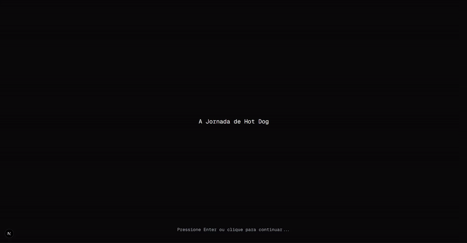
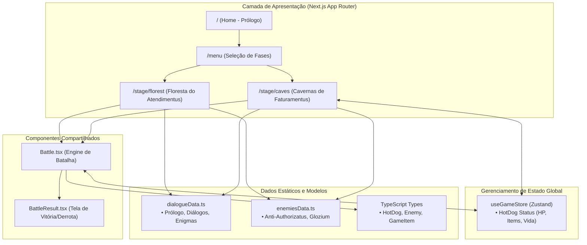

# ⚔️ Desafio Técnico `Acelera ZG 9.0`

[](https://www.typescriptlang.org/)
[](https://nextjs.org/)
[](https://react.dev/)
[](https://tailwindcss.com/)
[](https://zustand-demo.pmnd.rs/)
[](https://desafio-zg9.vercel.app/)

> 🇧🇷 **Português** | 🇺🇸 [**English Version**](README.en.md)

Uma aventura interativa em formato RPG baseada em narrativa e escolhas estratégicas inspirada no universo da saúde suplementar e faturamento hospitalar, desenvolvida como solução para o desafio técnico do processo seletivo **Acelera ZG 9.0**.

## 📌 Navegação Rápida

- [📝 Sobre o Projeto](#-sobre-o-projeto)
- [🖼️ Preview](#️-preview)
- [🌐 Deploy da Aplicação](#-deploy-da-aplicação)
- [✨ Funcionalidades](#-funcionalidades)
- [🛠️ Tecnologias e Ferramentas Utilizadas](#️-tecnologias-e-ferramentas-utilizadas)
- [🏛️ Arquitetura da Solução](#️-arquitetura-da-solução)
- [📁 Estrutura do Repositório](#-estrutura-do-repositório)
- [💡 Decisões Técnicas](#-decisões-técnicas)
- [🚀 Como Executar o Projeto](#-como-executar-o-projeto)

## 📝 Sobre o Projeto

O projeto consiste em um jogo de RPG interativo via web onde o jogador controla o herói **Hot Dog** em uma jornada para salvar a província de **Hospitalis** da ameaça cíclica de **Glozium**. 

O universo do jogo faz alusão ao ecossistema de saúde e processamento de contas médicas (autorizações, faturamento, auditoria e glosas). O jogador avança por cenários temáticos enfrentando inimigos em um sistema de combate por turnos probabilístico baseado em números secretos e itens especiais, além de solucionar enigmas conceituais que impactam diretamente o combate.

## 🖼️ Preview

<div align="center">
  
</div>

## 🌐 Deploy da Aplicação

Acesse a aplicação em produção:
👉 **[Desafio Acelera ZG 9.0](https://desafio-zg9.vercel.app/)**

## ✨ Funcionalidades

- 📖 **Prólogo e Narrativa Imersiva**: Sistema de diálogo interativo com suporte a navegação por teclado (`Enter`) ou clique.
- 🗺️ **Seleção de Fases (Mapa de Aventuras)**: Menu dinâmico com fases ativas e bloqueadas.
- ⚔️ **Sistema de Batalha por Turnos**:
  - Mecânica de sorteio numérico aleatório comparado ao número secreto do oponente.
  - Multiplicador de dano baseado no valor do número secreto e acertos.
  - Log em tempo real com auto-scroll de todas as ações de combate.
- 🎒 **Gerenciamento de Inventário & Itens Especiais**:
  - **Espada Simples**: Habilita o ataque base.
  - **Salsichinha**: Concede ataque combinado com dano bônus (+1).
  - **Guia de Atendimento**: Concede sorteio duplo por rodada.
- 🧩 **Enigmas e Consequências em Tempo Real**: Desafios conceituais onde escolhas erradas causam dano ao herói ou fortalecem (*buff*) os chefes.
- 🧠 **Persistência de Estado Global**: Estado do herói, vida máxima/atual e inventário mantidos entre rotas com Zustand.

## 🛠️ Tecnologias e Ferramentas Utilizadas

| Camada / Finalidade | Tecnologia | Descrição |
| :--- | :--- | :--- |
| **Framework Web** | **Next.js 16 (App Router)** | Renderização otimizada com arquitetura React Server/Client Components |
| **Biblioteca de UI** | **React 19** | Biblioteca base para construção declarativa de componentes e hooks |
| **Linguagem Principal** | **TypeScript 5.x** | Tipagem estática garantindo consistência de modelos, estados e eventos |
| **Estilização** | **Tailwind CSS 4.x** | Utilitários modernos para estilização rápida, responsiva e efeitos visuais |
| **Gerenciamento de Estado** | **Zustand 5.0.9** | Gerenciamento de estado global leve e desacoplado para dados do herói |
| **Qualidade e Padronização** | **ESLint 9.x** | Análise estática de código e aderência às melhores práticas |
| **Controle de Versão** | **Git & GitHub** | Versionamento semântico de código e hospedagem do repositório |
| **Plataforma de Deploy** | **Vercel** | Hospedagem contínua com deploy automático e alta performance |

## 🏛️ Arquitetura da Solução



## 📁 Estrutura do Repositório

```text
desafio-zg9/
├── frontend/
│   ├── public/
│   │   ├── projeto.gif          # Demonstração animada da aplicação
│   │   ├── sal2.png             # Imagem do item Salsichinha
│   │   ├── scroll.png           # Imagem do item Guia de Atendimento
│   │   └── sword.png            # Imagem do item Espada Simples
│   ├── src/
│   │   ├── app/
│   │   │   ├── globals.css      # Estilos globais e diretivas Tailwind
│   │   │   ├── layout.tsx       # Layout raiz da aplicação
│   │   │   ├── menu/
│   │   │   │   └── page.tsx     # Menu de seleção de fases
│   │   │   ├── stage/
│   │   │   │   ├── caves/
│   │   │   │   │   └── page.tsx # Fase Cavernas de Faturamentus + Enigma
│   │   │   │   └── florest/
│   │   │   │       └── page.tsx # Fase Floresta do Atendimentus
│   │   │   └── page.tsx         # Prólogo e introdução da história
│   │   ├── components/
│   │   │   ├── Battle.tsx       # Componente do motor de batalha e itens
│   │   │   └── BattleResult.tsx # Componente de feedback final de combate
│   │   ├── data/
│   │   │   ├── dialogueData.ts  # Roteiros narrativos, estágios e enigmas
│   │   │   └── enemiesData.ts   # Configurações de atributos dos inimigos
│   │   ├── stores/
│   │   │   └── useGameStore.ts  # Store Zustand do Herói
│   │   └── types/
│   │       ├── enemies.ts       # Definição de tipos dos inimigos
│   │       └── hotdog.ts        # Definição de tipos do herói
│   ├── package.json             # Dependências e scripts do projeto
│   └── tsconfig.json            # Configuração do compilador TypeScript
├── README.en.md                 # Documentação em Inglês
└── README.md                    # Documentação em Português
```

## 💡 Decisões Técnicas

1. **Next.js 16 com App Router**: Facilidade no roteamento declarativo e separação clara entre páginas de narrativa, fases e menus.
2. **Gerenciamento de Estado com Zustand**: Escolhido pela sua API limpa, sem boilerplate excessivo (ao contrário de Redux), permitindo sincronizar o estado do herói (HP atual, HP máximo, itens desbloqueados) entre as rotas sem recarregamentos indesejados.
3. **Mecânica de Batalha Desacoplada**: O componente `Battle` foi concebido de forma genérica e reutilizável, recebendo inimigos, textos de vitória/derrota e callbacks de recompensa por propriedades (`props`), facilitando a escalabilidade de novas fases.
4. **Sistema de Enigmas com Impacto Real**: As escolhas nos enigmas não são meramente cosméticas; penalidades aplicam dano direto ao herói ou aumentam os atributos do chefe antes do início do confronto.
5. **Acessibilidade e Interatividade**: Suporte duplo a teclado (`Enter`) e cliques para progressão dos diálogos, permitindo uma navegação fluida tanto no desktop quanto no mobile.

## 🚀 Como Executar o Projeto

### Pré-requisitos

- [Node.js](https://nodejs.org/) (versão 18.x ou superior recomendada)
- [npm](https://www.npmjs.com/) ou gerenciador de pacotes equivalente

### Passo a Passo

1. **Clone o repositório:**

   ```bash
   git clone https://github.com/ludson96/desafio-zg9.git
   cd desafio-zg9
   ```

2. **Acesse a pasta do frontend:**

   ```bash
   cd frontend
   ```

3. **Instale as dependências:**

   ```bash
   npm install
   ```

4. **Inicie o servidor de desenvolvimento:**

   ```bash
   npm run dev
   ```

5. **Acesse a aplicação no navegador:**

   ```text
   http://localhost:3000
   ```

<div align="center">
  Desenvolvido por <strong>Ludson Pereira dos Santos</strong> 🚀<br />
  <a href="https://www.linkedin.com/in/ludson96/">LinkedIn</a> • <a href="https://github.com/ludson96">GitHub</a> • <a href="mailto:ludson_ps27@hotmail.com">E-mail</a>
</div>
